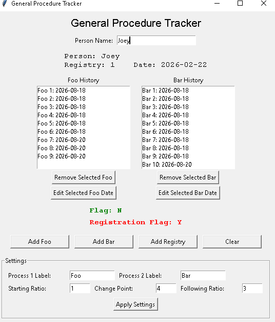
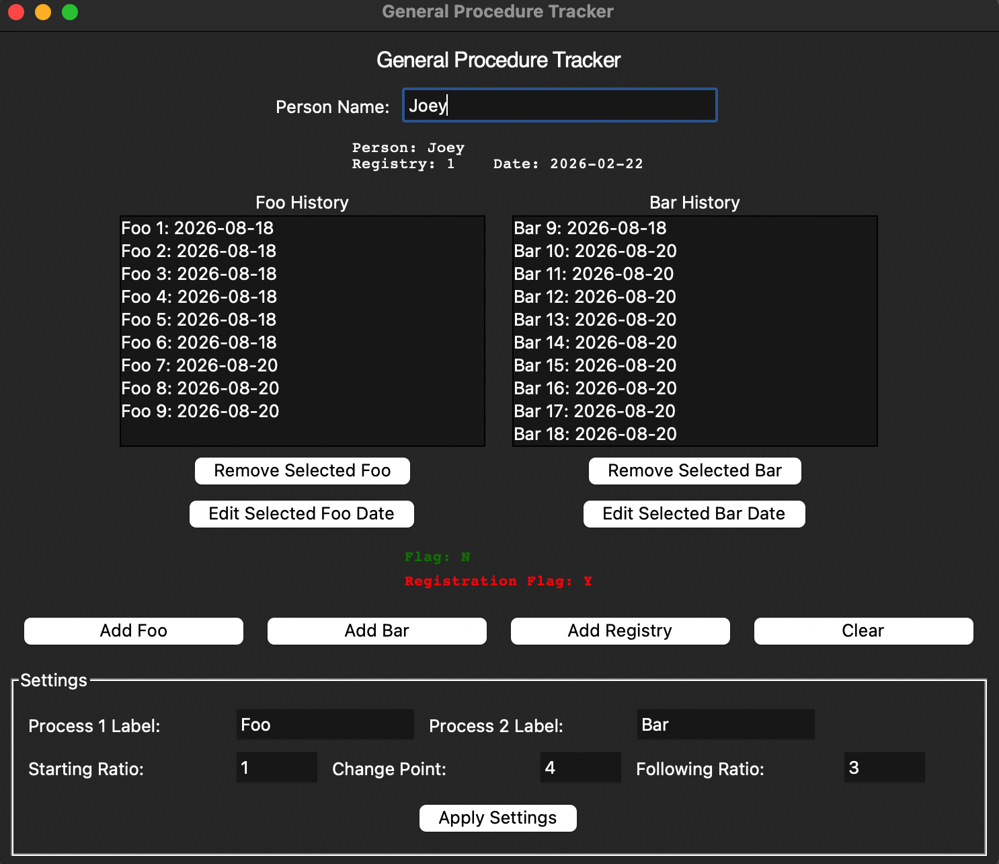

# General-Procedure-Tracker
A configurable desktop app for tracking recurring procedures for a list of people or items, built with Python and Tkinter.


> **Disclaimer:** This software is provided for demonstration and general record-tracking purposes. Do not use it to store sensitive personal or regulated information (e.g. real medical, financial, or otherwise legally protected data) without independently evaluating the applicable legal, privacy, and security requirements. Ships with a blank data template.

## Why this exists

I built this to practice desktop app architecture, data modeling, and turning a narrow, domain-specific tool into a genuinely reusable one. It started as a single-purpose tracker for a specific use case with two hardcoded procedure types on a fixed schedule; I refactored it into a generic version where both the labels and the underlying scheduling rule are configuration, not code.

Some of the scaffolding was AI-assisted. The scheduling algorithm below was not: an AI tool attempted to create the recurrence relation to no avail, so I derived the closed-form version myself and verified it against the original hardcoded behavior before generalizing it.

## Features

- **Track two recurring procedure types per person**, plus a separate registry/enrollment date
- **Fully relabelable at runtime:** rename "Process 1" / "Process 2" to whatever your use case needs from the in-app Settings panel; every button, header, and list updates instantly
- **Configurable due-date schedule** via three parameters (Starting Ratio, Change Point, Following Ratio). See [How the scheduling works](#how-the-scheduling-works) below
- **Automatic status flags** (color-coded) showing who's currently due for their next procedure, and whether someone's registry enrollment has lapsed
- **CSV-backed storage:** human-readable, portable, easy to inspect or edit by hand
- **Editable history per person:** add, remove, or correct individual dates after the fact
- Packagable as a standalone desktop app (Windows/macOS) via PyInstaller

## Windows and Mac screenshots





## Getting the app

There are two ways to use this project, depending on what you want to do.

### Just want to run it

Download the prebuilt app for your OS from the [Releases](../../releases) page. No Python or any other setup required, just download and run. Each release includes a blank `people.csv` with the correct headers already in place; keep it in the same folder as the app.

### Building it yourself

Everything below (Python, pandas, PyInstaller) is only needed if you want to build the app from source or modify the code. If you just want to use the app, use the Releases page instead.

**Requirements:** Python 3.11+, [pandas](https://pypi.org/project/pandas/)

```bash
git clone https://github.com/<SamSlutz>/general-procedure-tracker.git
cd general-procedure-tracker
pip install pandas
python tracker_gui_tk.py
```

This repo includes a blank `people.csv` (inside `builds/`) with the header row already set, so you can run it immediately without creating your own data file.

## Usage

1. **Type a name** and press Enter (or click away). This loads an existing person or creates a new one.
2. **Add Process 1 / Add Process 2 / Add Registry:** each opens a small dialog pre-filled with today's date. Press Enter to accept it, or type a different date to backdate an entry.
3. **Remove Selected / Edit Selected:** select an entry in either history list to correct or delete it.
4. **Settings panel** (bottom of the window): relabel the two procedure types, and tune the schedule that drives the status flag (see below). Click **Apply Settings** to save; this also retroactively recalculates every existing person's flag under the new rule.

Settings persist across runs in a small `tracker_config.json` file saved next to `people.csv`.

## How the scheduling works

The app tracks a "Flag" per person: whether they're currently due for their next Process 1, driven by three numbers:

| Parameter | Meaning |
|---|---|
| **Starting Ratio** | How many Process 2 entries occur between Process 1 entries at the start |
| **Change Point** | How many Process 1 occurrences the starting ratio applies to, before the schedule changes |
| **Following Ratio** | How many Process 2 entries occur between Process 1 entries after the change point |

For example, `Starting Ratio = 1, Change Point = 4, Following Ratio = 3` alternates 1:1 for the first four Process 1 occurrences, then settles into one Process 1 per three Process 2 occurrences after that, producing this pattern:

```
P1, P2, P1, P2, P1, P2, P1, P2, P2, P2, P1, P2, P2, P2, P1, ...
```

This generalizes to a closed-form recurrence. The cumulative Process 2 count at which the *n*th Process 1 becomes due is:

```
if n <= change_point:
    due_at(n) = (n - 1) * starting_ratio
else:
    due_at(n) = (change_point - 1) * starting_ratio + (n - change_point) * following_ratio
```

Any combination of the three parameters produces a valid, consistent schedule. This isn't hardcoded to the 1/4/3 example above.

The only remaining hardcoded value in the app is the registry lapse window, fixed at 6 months (see [Known limitations](#known-limitations)).

## Using your own data

`people.csv` uses the header row the app expects:

```
Name,Registry,Registry Date,Process 1,Process 1 Date,Process 2,Process 2 Date,Flag,Registration Flag
```

To point the app at your own dataset, reshape your CSV to match this header row exactly (column order doesn't matter, but the names do). The in-app Settings panel only changes what's displayed in the GUI; the actual CSV column names stay fixed unless you also edit the `kwargs.get(...)` calls and `to_dict()` method in `builds/tracker.py`'s `Person` class to match different header names.

## Project structure

```
.
├── tracker_gui_tk.py     # Tkinter GUI, main entry point
└── builds/
    ├── __init__.py        # makes builds/ importable as a package, required
    ├── tracker.py         # Data model (Person class), scheduling logic, CSV I/O, CLI mode
    └── people.csv          # Blank data file, used automatically when running from source
```

`tracker_config.json` is created automatically next to `people.csv` the first time you run the app.

`tracker.py` also works standalone as a command-line version of the same tool. Run `python builds/tracker.py` for a terminal-based menu with the same feature set.

## Building a standalone app

### Windows

Open PowerShell in the project folder (the one containing `tracker_gui_tk.py`) and run:

```powershell
& "C:\Path\To\Your\Python311\Scripts\pyinstaller.exe" --clean --onedir --windowed --name Tracker tracker_gui_tk.py
```

Your `pyinstaller.exe` path will be different. Find yours by running `where pyinstaller` after installing it with `pip install pyinstaller`, or check inside your Python installation's `Scripts` folder. Calling the `.exe` directly like this avoids any confusion between multiple Python installs on the same machine.

This produces `dist\Tracker\Tracker.exe`. Copy a blank `people.csv` into that same `dist\Tracker\` folder, next to `Tracker.exe`. The frozen app looks for `people.csv` in its own folder, not inside any `builds\` subfolder, even though that's where it lives in the source tree.

### macOS

```bash
pip install pyinstaller
pyinstaller --windowed tracker_gui_tk.py
```

Place a blank `people.csv` next to the resulting `.app` bundle the same way.

## Known limitations

This is a portfolio-scale project, not a production system:

- One flat table per data file
- Single-user, single-file access
- No authentication, encryption, or audit trail
- Local CSV storage only
- Registry lapse window is hardcoded to 6 months

## License

License: MIT. See LICENSE for the full license text.

## Acknowledgments

Built with general-purpose AI coding assistants for scaffolding and refactoring. The core scheduling algorithm was independently derived and verified against the original hardcoded behavior before being generalized.
